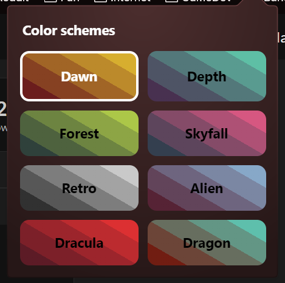

# itch.io custom dashboard colors

A chromium extension to replace dashboard colors on itch.io

## Usage

This plugin only works on [itch.io/dashboard](https://itch.io/dashboard) and sub-pages.

When not on the mentioned page, the plugin will display the following message :

## Settings

Here are the available color schemes :

## Installation

Decompress the plugin archive into a folder.\
Open your browser's extension page and toggle "developer mode".\
A button should appear to load extensions from local files.

⚠️ This method will only work with folders and not archives ⚠️